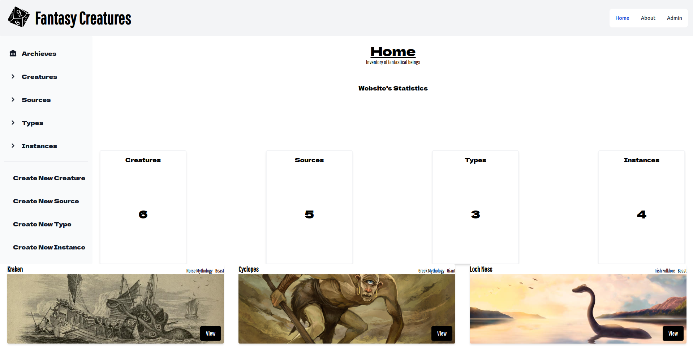

 
  
  
  
  

### Fantasy - Inventory

A Fantasy Library for cataloguing different creatures.

<a href='https://infinite-mesa-17935.herokuapp.com/archieve'> Click here! </a> to check out the demo.

## About

This project is a full-stack application following the MVC pattern. Every user can create sections by filliout out forms of their favourite creature, source, or family. The api is created with ExpressJS && Database request are handled by Mongoose. It also uses EJS machine for rendering along with TailwindCSS styling.

